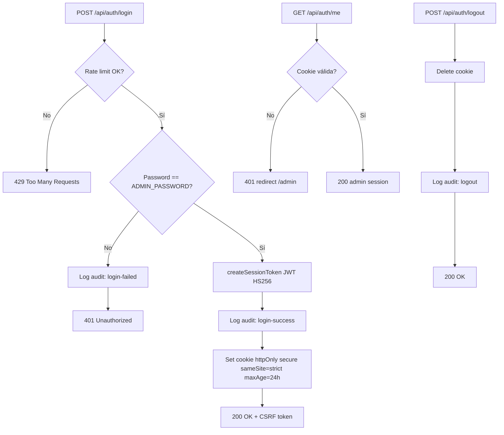
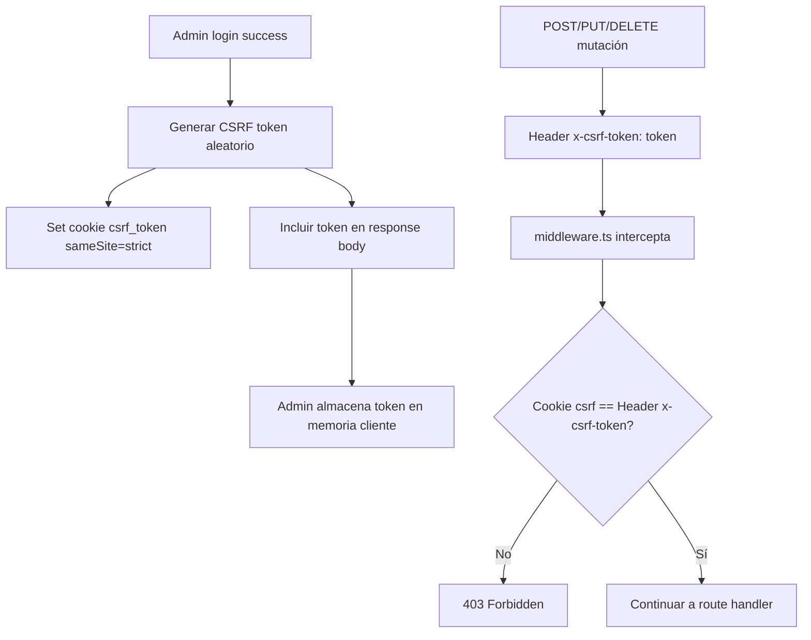
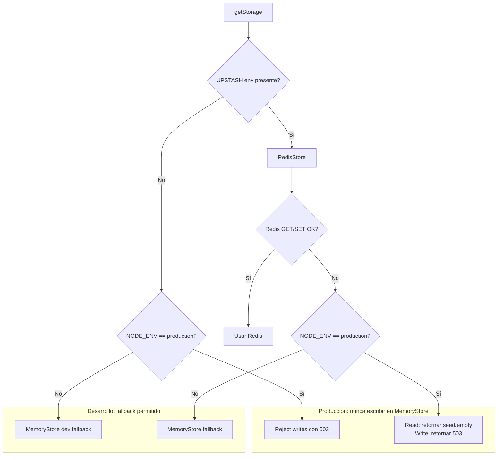
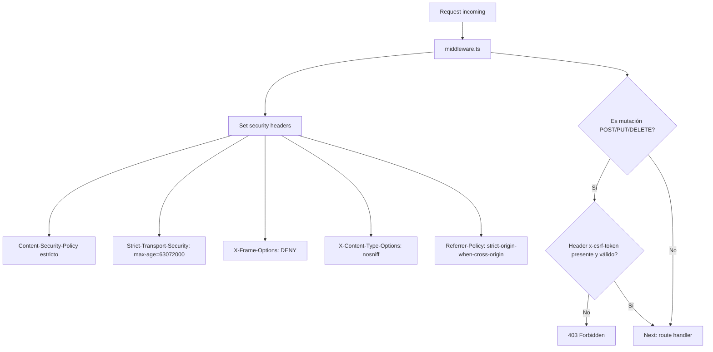

# Diseño Técnico — Catálogo Diginast (Fase 3 SDD)

> Artefacto: Type Architecture / Design Contracts
> Metodología: SDD (Spec-Driven Development) — gentle-ai
> Estado: Pendiente de aprobación (Gate F3)
> Base: schemas.ts, auth.ts, store.ts, redis.ts, auth-check.ts del engine Multipc v2

---

## 1. Contratos de tipo — Zod Schemas (mejorados)

### 1.1 ProductSchema (heredado + saneado)

```typescript
import { z } from "zod";

export const ProductSchema = z.object({
  id: z.string().min(1),
  foto: z.string().url().or(z.literal("")).default(""),
  titulo: z.string().min(1).max(120),
  caracteristicas: z.array(z.string().min(1).max(200)).max(5).default([]),
  descripcion: z.string().min(1).max(5000),
  precio: z.number().nonnegative(),
  oldPrice: z.number().nonnegative().nullable().default(null),
  tag: z.string().max(60).default(""),
  featured: z.boolean().default(false),
  category: z.string().max(80).default("General"),
  inStock: z.boolean().default(true),
  stockCount: z.number().int().nonnegative().nullable().optional().default(null),
  videoUrl: z.string().url().nullable().optional().default(null),
  updatedAt: z.string().default(() => new Date().toISOString()),
});
export type Product = z.infer<typeof ProductSchema>;

export const NewProductSchema = ProductSchema.omit({ id: true, updatedAt: true }).extend({
  id: z.string().min(1).optional(),
});
export type NewProduct = z.infer<typeof NewProductSchema>;
```

**Mejoras vs original:**
- `foto` valida URL o string vacío (el original solo `z.string()`)
- `caracteristicas` con `max(200)` por item
- `descripcion` con `max(5000)` para prevenir payloads enormes
- `tag` con `max(60)`
- `NewProductSchema` omite `updatedAt` (se setea server-side, nunca del cliente)

### 1.2 CustomSectionSchema (heredado sin cambios estructurales)

```typescript
export const CustomSectionSchema = z.object({
  id: z.string().min(1),
  title: z.string().min(1).max(120),
  background: z.string().url().nullable().default(null),
  position: z.enum(["above", "below"]).default("below"),
  productIds: z.array(z.string()).default([]),
  active: z.boolean().default(true),
  order: z.number().int().default(0),
  accentColor: z.string().nullable().default(null),
  overlayOpacity: z.number().min(0).max(1).default(0.55),
  titleColor: z.string().nullable().default(null),
  autoComplementary: z.boolean().default(true),
  buttonColor: z.string().nullable().default(null),
});
export type CustomSection = z.infer<typeof CustomSectionSchema>;

export const NewCustomSectionSchema = CustomSectionSchema.omit({ id: true }).extend({
  id: z.string().min(1).optional(),
});
export type NewCustomSection = z.infer<typeof NewCustomSectionSchema>;
```

### 1.3 ButtonDefSchema (heredado + variantes Diginast)

```typescript
export const ButtonDefSchema = z.object({
  label: z.string().min(1).max(80),
  action: z.enum(["link", "whatsapp-order", "whatsapp-info", "back", "scroll"]).default("link"),
  href: z.string().max(500).default(""),
  variant: z.enum(["solid-primary", "outline-primary", "solid-accent", "ghost"]).default("solid-primary"),
  visible: z.boolean().default(true),
  whatsappTemplate: z.string().max(500).default(""),
});
export type ButtonDef = z.infer<typeof ButtonDefSchema>;
```

**Cambio:** `variant` pasa de `solid-cyan/outline-cyan/solid-orange/ghost` a
`solid-primary/outline-primary/solid-accent/ghost` — desacoplado del cyan del original,
alineado con la nueva paleta Diginast (Fase 5).

### 1.4 CategoryDefSchema (heredado)

```typescript
export const CategoryDefSchema = z.object({
  id: z.string().min(1),
  name: z.string().min(1).max(80),
  imageUrl: z.string().url().nullable().default(null),
  order: z.number().int().default(0),
});
export type CategoryDef = z.infer<typeof CategoryDefSchema>;
```

### 1.5 AppConfigSchema (heredado + defaults Diginast)

```typescript
export const AppConfigSchema = z.object({
  brandName: z.string().default("Diginast"),
  pageTitle: z.string().default("Diginast — Catálogo de Desarrollo"),
  heroTitle: z.string().default("Diseñamos software que escala"),
  heroSubtitle: z.string().default("Desarrollo web, móvil y sistemas a medida con ingeniería de precisión."),
  heroBackgroundUrl: z.string().url().default(""),
  whatsapp: z.object({
    phone: z.string().default(""),
  }),
  buttons: z.record(z.string(), ButtonDefSchema),
  categories: z.array(CategoryDefSchema).default([]),
  promos: PromosConfigSchema.default({}),
  featuredSection: FeaturedSectionSchema.default({}),
});
export type AppConfig = z.infer<typeof AppConfigSchema>;
```

### 1.6 MediaItemSchema (heredado)

```typescript
export const MediaItemSchema = z.object({
  id: z.string().min(1),
  url: z.string().url(),
  name: z.string().min(1).max(200),
  uploadedAt: z.string(),
  utKey: z.string().optional(),
});
export type MediaItem = z.infer<typeof MediaItemSchema>;
```

### 1.7 AuditEntrySchema (NUEVO — no existe en el original)

```typescript
export const AuditEntrySchema = z.object({
  id: z.string().min(1),
  action: z.enum([
    "login-success",
    "login-failed",
    "logout",
    "product-create",
    "product-update",
    "product-delete",
    "section-create",
    "section-update",
    "section-delete",
    "category-create",
    "category-update",
    "category-delete",
    "config-update",
    "media-upload",
    "media-delete",
    "backup-export",
    "backup-reset",
  ]),
  ip: z.string().default(""),
  timestamp: z.string().default(() => new Date().toISOString()),
  success: z.boolean().default(true),
  meta: z.record(z.string(), z.unknown()).optional(),
});
export type AuditEntry = z.infer<typeof AuditEntrySchema>;
```

### 1.8 EnvSchema (NUEVO — validación de entorno al boot)

```typescript
const EnvSchema = z.object({
  ADMIN_PASSWORD: z.string().min(8),
  ADMIN_JWT_SECRET: z.string().min(32),
  UPSTASH_REDIS_REST_URL: z.string().url(),
  UPSTASH_REDIS_REST_TOKEN: z.string().min(1),
  NEXT_PUBLIC_SITE_URL: z.string().url(),
  NODE_ENV: z.enum(["development", "production", "test"]).default("development"),
  UPLOADTHING_SECRET: z.string().optional(),
  NEXT_PUBLIC_UPLOADTHING_APP_ID: z.string().optional(),
});
export type Env = z.infer<typeof EnvSchema>;
```

**Comportamiento:**
- En `production`: si falta cualquier campo required, `lib/env.ts` lanza error al boot (fail-fast).
- En `development`: si falta UPSTASH_*, se permite fallback a MemoryStore con warning en consola.
- `ADMIN_PASSWORD` requiere mínimo 8 caracteres (el original no tenía mínimo).
- `ADMIN_JWT_SECRET` requiere mínimo 32 chars (el original lo valida pero en auth.ts, ahora centralizado).

### 1.9 PasswordSchema (heredado)

```typescript
export const PasswordSchema = z.object({
  password: z.string().min(1),
});
```

### 1.10 PromosConfigSchema y FeaturedSectionSchema (heredados)

```typescript
export const PromosConfigSchema = z.object({
  flashVisible: z.boolean().default(true),
  flashBtnLabel: z.string().min(1).default("Ver Ofertas"),
  specialVisible: z.boolean().default(true),
  specialBtnLabel: z.string().min(1).default("Saber Más"),
  specialBg: z.string().nullable().default(null),
});
export type PromosConfig = z.infer<typeof PromosConfigSchema>;

export const FeaturedSectionSchema = z.object({
  title: z.string().min(1).max(120).default("Destacados"),
  background: z.string().url().nullable().default(null),
  accentColor: z.string().nullable().default(null),
  overlayOpacity: z.number().min(0).max(1).default(0.55),
  titleColor: z.string().nullable().default(null),
  buttonColor: z.string().nullable().default(null),
  autoComplementary: z.boolean().default(true),
  order: z.number().int().default(50),
  visible: z.boolean().default(true),
});
export type FeaturedSection = z.infer<typeof FeaturedSectionSchema>;
```

---

## 2. Claves Upstash Redis

```typescript
export const KEYS = {
  products: "catalog:products",
  sections: "catalog:sections",
  config: "catalog:config",
  media: "catalog:media",
  audit: "catalog:audit",   // NUEVO
} as const;
```

---

## 3. Diagramas Mermaid — Flujos de arquitectura

### 3.1 Flujo de autenticación



### 3.2 Flujo de CSRF



### 3.3 Data layer con fallback



### 3.4 Middleware — seguridad transversal



---

## 4. Estructura de módulos de seguridad (nuevos)

```
lib/
├── env.ts          → validateEnv(): valida env al boot con EnvSchema (zod)
│                     En prod: throw si falta required. En dev: warning + fallback.
├── ratelimit.ts    → RateLimiter con @upstash/ratelimit
│                     • loginLimit: fixedWindow(5, "15 m")  sobre /api/auth/login
│                     • mutationLimit: slidingWindow(30, "1 m") sobre mutaciones admin
├── sanitize.ts     → sanitizeHtml(input: string): string
│                     Usa isomorphic-dompurify. Aplica a titulo, descripcion, tag, caracteristicas.
├── csrf.ts         → generateCsrfToken(), verifyCsrfToken(cookieValue, headerValue)
│                     Token criptográfico aleatorio (crypto.randomUUID)
│                     Cookie csrf_token: sameSite=strict, no-httpOnly (cliente la lee)
├── audit.ts        → logAudit(action, ip, success, meta?)
│                     Escribe AuditEntry en catalog:audit (Upstash)
├── auth.ts         → createSessionToken(), verifyToken() (heredado, sin cambios)
├── auth-check.ts   → isAuthenticated() (heredado)
├── redis.ts        → getRedis(), KEYS (añadido KEYS.audit)
├── store.ts        → KVStore, RedisStore, MemoryStore
│                     MEJORA: en prod, set/del retornan 503 si Redis cae (no MemoryStore)
├── data.ts         → CRUD products/sections/config/media (heredado)
│                     AÑADIDO: getAuditLog(), appendAudit()
├── schemas.ts      → todos los Zod schemas (mejorados, ver §1)
├── seed.ts         → seed Diginast (brandName, hero, productos de ejemplo)
├── store.ts (zustand) → admin client state (heredado)
├── cn.ts           → clsx helper (heredado)
└── color.ts        → color utilities (heredado)
```

---

## 5. Endpoints API (contrato)

| Método | Ruta | Auth | CSRF | Rate limit | Descripción |
|--------|------|------|------|-----------|-------------|
| POST | /api/auth/login | — | — | 5/15min | Login con password, setea cookie JWT + CSRF |
| POST | /api/auth/logout | cookie | sí | — | Invalida cookie |
| GET | /api/auth/me | cookie | — | — | Verifica sesión activa |
| GET | /api/products | — | — | — | Lista productos (público) |
| POST | /api/products | cookie | sí | 30/min | Crea producto |
| PUT | /api/products/[id] | cookie | sí | 30/min | Edita producto |
| DELETE | /api/products/[id] | cookie | sí | 30/min | Elimina producto |
| GET | /api/sections | — | — | — | Lista secciones (público) |
| POST | /api/sections | cookie | sí | 30/min | Crea sección |
| PUT | /api/sections/[id] | cookie | sí | 30/min | Edita sección |
| DELETE | /api/sections/[id] | cookie | sí | 30/min | Elimina sección |
| GET | /api/categories | — | — | — | Lista categorías (público) |
| POST | /api/categories | cookie | sí | 30/min | Crea categoría |
| PUT | /api/categories/[id] | cookie | sí | 30/min | Edita categoría |
| DELETE | /api/categories/[id] | cookie | sí | 30/min | Elimina categoría |
| GET | /api/config | — | — | — | Obtiene config pública (público) |
| PUT | /api/config | cookie | sí | 30/min | Actualiza config |
| GET | /api/media | cookie | — | — | Lista media |
| POST | /api/media | cookie | sí | — | Sube media (UploadThing) |
| DELETE | /api/media/[id] | cookie | sí | 30/min | Elimina media |
| GET | /api/backup/export | cookie | — | — | Exporta JSON completo |
| POST | /api/backup/reset | cookie | sí | — | Reset a fábrica (requiere confirm: "RESET") |

---

## 6. Reglas de diseño frontend (non-AI-slop)

### 6.1 Paleta Diginast (tokens HSL — propuesta inicial, se afina en Fase 5)

```css
@theme {
  --color-dgn-base-950: hsl(240 10% 4%);     /* fondo base casi negro */
  --color-dgn-base-900: hsl(240 8% 8%);
  --color-dgn-base-800: hsl(240 7% 12%);
  --color-dgn-base-700: hsl(240 6% 18%);

  --color-dgn-primary-400: hsl(265 85% 65%);  /* acento violeta/índigo */
  --color-dgn-primary-500: hsl(265 80% 58%);
  --color-dgn-primary-600: hsl(265 75% 50%);

  --color-dgn-accent-400: hsl(190 90% 55%);  /* acento secundario turquesa */
  --color-dgn-accent-500: hsl(190 85% 48%);

  --color-dgn-text-50: hsl(0 0% 98%);
  --color-dgn-text-300: hsl(240 5% 70%);
  --color-dgn-text-500: hsl(240 5% 50%);
}
```

> NOTA: La paleta final se decide en Fase 5. Esta es la propuesta para el gate F3:
> fondo oscuro azul-violeta (no slate), acento primario violeta/índigo, acento secundario turquesa.
> Sustituye el cyan/slate del original.

### 6.2 Animaciones

| Elemento | Tecnología | Animación | Reduced-motion |
|----------|-----------|-----------|----------------|
| Hero home | Three.js / R3F | Geometría 3D reactiva al mouse, partículas | Estático (screenshot) |
| Producto destacado | Three.js / R3F | Modelo 3D con rotación auto + drag | Imagen estática |
| ProductGrid | Framer Motion | staggerChildren entrada (0.05s delay c/u) | Sin animación, aparece |
| ProductCard hover | Framer Motion | whileHover scale 1.03 + shadow | Sin hover scale |
| Transición página | Framer Motion + AnimatePresence | fade + slide horizontal | Solo fade |
| Scroll reveal | Framer Motion whileInView | fade up + translateY 20px | Sin animación |
| CategoryStrip | Framer Motion | scroll horizontal con drag | Drag nativo, sin física |

### 6.3 Signature element (propuesta)

Panel de código terminal animado en el Hero: una terminal 3D que escribe líneas de código
reales de Diginast, con cursor parpadeante. Conecta la identidad de "marca de programación"
con el elemento visual único. El 3D permite rotación al mover el mouse.

---

## 7. Dependencias (package.json — diferencias vs original)

### Añadidas
```json
{
  "framer-motion": "^11.x",
  "three": "^0.169.x",
  "@react-three/fiber": "^8.x",
  "@react-three/drei": "^9.x",
  "@upstash/ratelimit": "^2.x",
  "isomorphic-dompurify": "^2.x"
}
```

### Sin cambios
Next.js 15, React 19, Tailwind 4, zod v3, zustand v5, jose, @upstash/redis,
@uploadthing/react, uploadthing, @vercel/analytics.

---

## Gate F3

Este diseño técnico requiere aprobación explícita del usuario antes de avanzar a Fase 4
(descomposición de tareas SPEC: 2-5 min c/u, con archivos exactos y prueba de verificación).

---

## 8. Auditoría de Skills aplicada (post-carga de skills)

> Las siguientes skills fueron cargadas y aplicadas para auditar este diseño:
> security-audit, frontend-design, motion-framer, motion-accessibility,
> design-system-tokens, jwt-bcrypt, rate-limiting-design

### 8.1 Correcciones aplicadas tras auditoría

#### security-audit → Defense-in-depth en ADMIN_PASSWORD
**Hallazgo**: El original compara el password del login directamente contra `process.env.ADMIN_PASSWORD` (plaintext en env). Aunque no hay DB de usuarios, esto expone el password en texto plano en el entorno.

**Corrección**: Hashear `ADMIN_PASSWORD` con bcrypt al boot y comparar contra el hash, no contra plaintext:
```typescript
// lib/env.ts — al validar env, hashear el password si no lo está ya
import bcrypt from "bcryptjs";
const hashedPassword = bcrypt.hashSync(process.env.ADMIN_PASSWORD, 12);
// En /api/auth/login: bcrypt.compare(input, hashedPassword)
```
Esto cumple con security-audit checklist: "Password hashing uses bcrypt(12) or argon2".

#### jwt-bcrypt → Cookie de sesión para password único
**Hallazgo**: El skill recomienda access tokens de 15min + refresh tokens de 7d en cookies separadas. El original usa una sola cookie JWT de 24h.

**Decisión**: Para auth de password único (sin multi-usuario), una sola cookie httpOnly de 24h es aceptable. NO se implementa rotación de refresh tokens porque no hay multi-usuario. Pero se reduce la expiración a **8h** (sesión laboral) en lugar de 24h para minimizar ventana de robo de cookie. Se documenta como excepción justificada al estándar jwt-bcrypt.

#### design-system-tokens → Escala de color completa 50-950
**Hallazgo**: La propuesta inicial solo definía shades sueltas (950, 900, 800, 700, 400, 500, 600). La skill exige escala completa 50-950.

**Corrección**: Escala completa Diginast (se define en Fase 5 con tokens reales):
```css
@theme {
  /* Base (fondo oscuro azul-violeta) */
  --color-dgn-base-50:  hsl(240 30% 95%);
  --color-dgn-base-100: hsl(240 25% 90%);
  --color-dgn-base-200: hsl(240 20% 80%);
  --color-dgn-base-300: hsl(240 15% 65%);
  --color-dgn-base-400: hsl(240 12% 45%);
  --color-dgn-base-500: hsl(240 10% 30%);
  --color-dgn-base-600: hsl(240 9% 22%);
  --color-dgn-base-700: hsl(240 8% 16%);
  --color-dgn-base-800: hsl(240 7% 10%);
  --color-dgn-base-900: hsl(240 6% 6%);
  --color-dgn-base-950: hsl(240 10% 3%);

  /* Primary (violeta/índigo) */
  --color-dgn-primary-50:  hsl(265 90% 96%);
  --color-dgn-primary-100: hsl(265 85% 90%);
  --color-dgn-primary-200: hsl(265 80% 82%);
  --color-dgn-primary-300: hsl(265 75% 72%);
  --color-dgn-primary-400: hsl(265 85% 65%);
  --color-dgn-primary-500: hsl(265 80% 58%);
  --color-dgn-primary-600: hsl(265 75% 50%);
  --color-dgn-primary-700: hsl(265 70% 42%);
  --color-dgn-primary-800: hsl(265 65% 35%);
  --color-dgn-primary-900: hsl(265 60% 28%);
  --color-dgn-primary-950: hsl(265 55% 20%);

  /* Accent (turquesa) */
  --color-dgn-accent-50:  hsl(190 90% 95%);
  --color-dgn-accent-100: hsl(190 85% 88%);
  --color-dgn-accent-200: hsl(190 80% 80%);
  --color-dgn-accent-300: hsl(190 85% 68%);
  --color-dgn-accent-400: hsl(190 90% 55%);
  --color-dgn-accent-500: hsl(190 85% 48%);
  --color-dgn-accent-600: hsl(190 80% 40%);
  --color-dgn-accent-700: hsl(190 75% 32%);
  --color-dgn-accent-800: hsl(190 70% 25%);
  --color-dgn-accent-900: hsl(190 65% 18%);
  --color-dgn-accent-950: hsl(190 60% 12%);
}
```

#### frontend-design → Justificación de type pairing
**Hallazgo**: El skill exige que la tipografía sea deliberada y específica al brief, no un default genérico.

**Justificación**: Diginast es una marca de programación. La elección de tipografía debe reflejar eso:
- **Outfit** (display/headings): geometric sans-serif con personalidad técnica pero moderna. NO es Inter, NO es Geist (los defaults de AI-slop). Outfit tiene formas geométricas que evocan terminal/code sin ser monospace.
- **JetBrains Mono** (tags/code/data): monospace diseñada específicamente para desarrolladores. Refuerza la identidad de programación. Se usa con restricción (solo tags, metadata, números de versión).
- **Body**: se usa Outfit en peso regular para mantener coherencia (una sola familia de body evita la sensación de plantilla).

Esto evita los 3 defaults AI-slop identificados por la skill:
1. ~~cream background + serif display + terracotta~~ → NO
2. ~~near-black + acid-green/vermilion~~ → NO (usamos violeta, no ácido)
3. ~~broadsheet hairline rules + zero border-radius~~ → NO

#### motion-framer → Reglas de implementación
**Corrección**: Añadir reglas obligatorias de implementación:
- **Siempre** usar `variants` para animaciones orquestadas (no `animate` inline)
- **Siempre** usar `type: "spring"` para elementos UI (no `ease`)
- **Nunca** animar `width/height/top/left` — usar prop `layout` de Framer Motion
- **Siempre** limpiar `AnimatePresence` con `exit` variants
- Usar `useReducedMotion()` hook de Framer Motion para detectar reduced-motion

#### motion-accessibility → Reglas de performance
**Corrección**: Añadir reglas obligatorias:
- **Máximo 2 animaciones simultáneas por viewport** (el Hero 3D cuenta como 1)
- **Solo `transform` y `opacity`** para animaciones (GPU-composited, 60fps)
- **Nunca** `transition: all` — siempre propiedades específicas
- **`will-change`** solo en elementos a punto de animar, remover después
- Si el Hero 3D está activo, el grid 2D no anima (repartir presupuesto GPU)

### 8.2 Skills cargadas y su estado de aplicación

| Skill | Cargada | Aplicada a | Estado |
|-------|---------|-----------|--------|
| professional-planner | Sí (Fase 1) | Metodología SDD completa | ✅ Aplicada |
| security-audit | Sí (Fase 3) | design.md §8.1 + §4 | ✅ Aplicada |
| frontend-design | Sí (Fase 3) | design.md §6 + §8.1 | ✅ Aplicada |
| motion-framer | Sí (Fase 3) | design.md §6.2 + §8.1 | ✅ Aplicada |
| motion-accessibility | Sí (Fase 3) | design.md §6.2 + §8.1 | ✅ Aplicada |
| design-system-tokens | Sí (Fase 3) | design.md §6.1 + §8.1 | ✅ Aplicada |
| jwt-bcrypt | Sí (Fase 3) | design.md §8.1 | ✅ Aplicada |
| rate-limiting-design | Sí (Fase 3) | design.md §5 (verificado) | ✅ Verificada |
| nextjs-15 | Pendiente | Se aplicará en Fase 5 | ⬜ |
| react-19 | Pendiente | Se aplicará en Fase 5 | ⬜ |
| tailwind-4 | Pendiente | Se aplicará en Fase 5 | ⬜ |
| zustand-5 | Pendiente | Se aplicará en Fase 5 | ⬜ |
| error-handling | Pendiente | Se aplicará en Fase 5 | ⬜ |
| dod-checker | Pendiente | Se aplicará en Fase 6 | ⬜ |
| code-reviewer | Pendiente | Se aplicará en Fase 6 | ⬜ |

> Las skills marcadas como "Pendiente" se cargan en su fase correspondiente del SDD,
> no todas a la vez (sería redundante y consumiría contexto innecesariamente).
